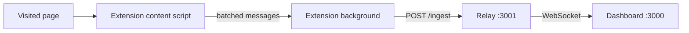

# Frontend Performance Observatory

A small monorepo for collecting Core Web Vitals and resource timings in Chrome and viewing them on a local Next.js dashboard.

**Full deployment (local + production):** [docs/DEPLOYMENT.md](./docs/DEPLOYMENT.md)

---

## How data flows

1. **Chrome extension — content script** (`packages/extension`) runs `@observatory/collector` on each page (except the dashboard on **port 3000**). It shows a small overlay and batches metrics to the background script.
2. **Chrome extension — background** (`fetch`) sends JSON to the **relay**: `POST http://127.0.0.1:3001/ingest` (HTTP is used instead of a service-worker WebSocket for reliability).
3. **Relay** (`apps/dashboard/scripts/ws-server.mjs`) stores metrics in memory (cap 500) and **broadcasts** each update to all connected WebSocket clients.
4. **Dashboard** (Next.js) opens **`ws://127.0.0.1:3001`**, receives snapshots + live events, and updates **Zustand** → charts (with client-side debouncing and a 500-metric cap).



**Not in the default path:** the **SDK** (`observatory-sdk.js`) is optional — it uses the same collector but emits `postMessage` for experiments. Do not load the SDK on the same page as the extension.

---

## Repository structure

| Path | Purpose |
|------|---------|
| `apps/dashboard` | Next.js 14 (App Router), Tailwind, Recharts, Zustand, WebSocket client |
| `apps/dashboard/scripts/ws-server.mjs` | HTTP + WebSocket relay (`/ingest`, `/health`) |
| `packages/collector` | Shared PerformanceObserver + overlay helpers |
| `packages/extension` | MV3 content + background |
| `packages/sdk` | Optional IIFE bundle for script-tag / `postMessage` testing |
| `packages/shared` | `Metric` types and helpers |

---

## Prerequisites

- Node.js 18+
- [pnpm](https://pnpm.io) 9+
- Google Chrome (for the extension)

## Install

```bash
pnpm install
```

Runs `prepare` and builds `@observatory/shared` (required by the dashboard).

## Quick start (development)

Run these in **separate terminals** from the repo root:

| Step | Command | What it does |
|------|---------|----------------|
| 1 | `pnpm ws` | Starts the **relay** on **3001** (`POST /ingest` + WebSocket + `GET /health`) |
| 2 | `pnpm dev` | Starts the **dashboard** on **3000** |
| 3 | `pnpm build:extension` then load unpacked | Builds `packages/extension` → Chrome **Load unpacked** → `packages/extension` |

Health check:

```bash
curl -s http://127.0.0.1:3001/health
```

Open the dashboard at **`http://127.0.0.1:3000`** (or use the extension **toolbar icon**). The extension does **not** auto-open tabs on install.

### Using the extension

- **Content script** is **not** injected on `http(s)://localhost:3000` or `http(s)://127.0.0.1:3000` so the Next.js UI is not instrumented (avoids React conflicts and self-referential metrics).
- Browse **any other** origin in a tab — metrics should appear on the dashboard if the relay is up and the top bar shows **WebSocket connected**.
- Static test file **`observatory-test.html`**: if you use `npx serve`, pick a port **other than 3000** while the dashboard uses 3000, e.g. `npx serve . -l 4173`.

### Optional: SDK (script tag)

For legacy or script-only experiments:

```bash
pnpm build:sdk
```

Output: `packages/sdk/dist/observatory-sdk.js`. Do **not** use the SDK together with the extension on the same page.

## Production build (all packages)

```bash
pnpm build
```

See [docs/DEPLOYMENT.md](./docs/DEPLOYMENT.md) for `next start`, running the relay in production, TLS, and configuring URLs.

---

## Notes

- **Ports:** dashboard **3000**, relay **3001** (change only with matching updates in extension + dashboard + docs).
- **Relay must be running** whenever you expect live metrics.
- Dashboard store: **~120ms** debounce on WebSocket batches; **max 500** metrics retained client-side; relay also caps at 500.
- **Theme (dashboard):** background `#0B1220`, cards `#1F2937`, text `#E5E7EB`.
